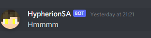
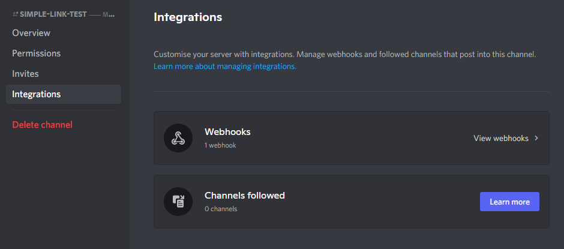
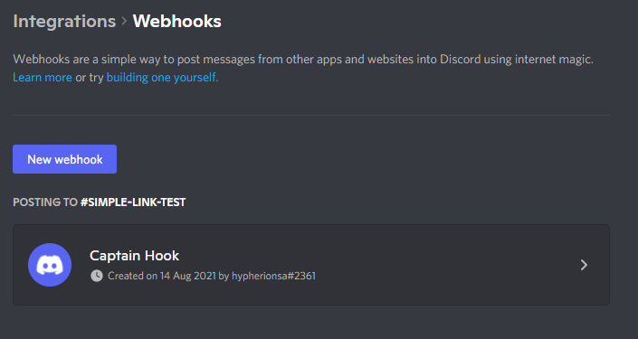
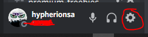
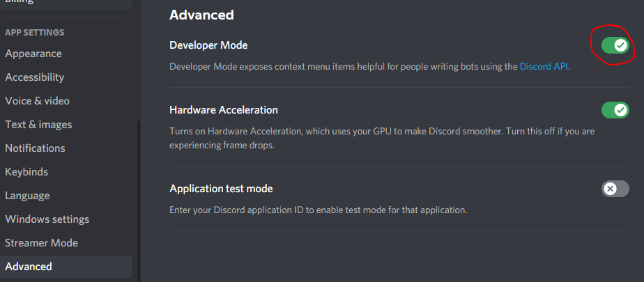

Before continuing, start your server atleast once to have the default config file generated. This file will be located under `config/simple-discord-bot.toml`. Once this file has generated, you can go ahead and shut down the server for now.

### Adding the required information

The very first thing to do, is to change the `botToken` field from "" to the token you copied from the previous setup. If you did not do this already, then please visit `Creating the Discord Bot`.
You can find the `botToken` in the `general` section of the config file.

AN EXAMPLE:

```toml
#General Mod Config
[general]
	#The Token of the Bot to use. KEEP THIS PRIVATE
	botToken = "ODcXXXg2ODA0MzkzNTAXXXXX.YRgajA.kzNCQLfGdVhKXXXie4rVC-EXXX"
	#Should the bot be enabled or not
	enabled = true
	#Should debug logging be enabled? WARNING: THIS CAN SPAM YOUR LOG!
	debugging = false
	activityUpdateInterval = 120
	#The prefix to use for bot commands. Example: ~players
	botPrefix = "~"
	#Should the bot be allowed to whitelist/un-whitelist players
	whitelisting = true
    #The status to display on the bot
	botStatus = "Playing Minecraft with %players% players"
```
&nbsp; &nbsp;
#### Webhooks vs Channels

This mod has two ways of delivering messages. You can choose which one to use. Using Channel Webhooks or using pre-configured channels. Webhooks require a bit more setup, but allows the bot to show the players' skin as the profile picture, and the player name as the name of the person that sent the message. Below is an example of a Webhook message.


&nbsp;

To configure this, go to a channel in Discord that you want to use for messages. Click the gear icon next to the channel name to open the channel settings. Next head over to `Integrations`.


To create a new webhook, click on `View Webhooks >` to open the webhooks screen.

&nbsp;

By default, discord will automatically create a new webhook if the channel does not have one. If you already have one or if a new one was created, click "Copy Webhook URL" to copy the URL to the dashboard. If you have an existing webhook, you may need to click on the webhook name to see this option.

Next, paste this URL into the config file where it says `webhookurl`. Also change `enabled` to true to make sure the bot uses webhooks. You can specify a `serverAvatar` link if you want. This is the profile picture that will be used by the bot when a message is sent from "SERVER".

AN EXAMPLE:

```toml
#Webhook Config
[webhookConfig]
	#Should webhook messages be used
	enabled = true
	#The URL of the channel webhook
	webhookurl = "https://discord.com/api/webhooks/123456761114300438/xxxxxxgiZCcR8Qc9v7k2lv2dWmxrWUXh35j0O8OoymC74LAGOoy8xyVU0NtU95-xxxxx"
	#A DIRECT link to an image to use as the avatar for server messages
	serverAvatar = ""
```

***

#### Configuring channels

The mod allows you to configure 2 channels to send messages in. If both are configured, one will be used for Chat messages only, and the other one for everything else.

You do not need to configure both, BUT, `channelID` must always be defined. If it is not, the bot will NOT send messages from discord back to minecraft.

First make sure you have Developer mode enabled in discord. To do/check this, click the gear icon next to your discord name.


&nbsp; &nbsp;

Next, scroll down to "APP SETTINGS" and click on `Advanced`. Make sure Developer mode is enabled



After doing this, go back to your discord server, choose a channel to use for the chat and right-click on the channel name, then click `Copy ID` on the popup menu. This will copy the Channel ID required for the config to the clipboard.

Next, change `channelID` from `0` to the value you copied in the previous step. If you wish to have a separate chat and events channel, then repeat the previous step on the channel you wish to use for logging and change `logChannelID` from `0` to the copied ID. 

You can leave `logChannelID` on `0`, then the mod will simply use your chat channel for everything. 

!!!warning
The log channel has no effect when Webhooks are enabled
!!!

AN EXAMPLE:

```toml
#Chat Config
[chatConfig]
	#The ID of the channel to post in. This will be ignored if webhooks are enabled
	channelID = 123457224520163438
	#If this ID is set, event messages will be posted in this channel instead of the chat channel
	logChannelID = 123428407002800200
```

***

You can now save the config file, and you should be ready to go. Once you start your Minecraft server, the bot should be up and running.

### The default, un-configured config file contents

```toml

#General Mod Config
[general]
	#The Token of the Bot to use. KEEP THIS PRIVATE
	botToken = ""
	#Should the bot be enabled or not
	enabled = true
	#Should debug logging be enabled? WARNING: THIS CAN SPAM YOUR LOG!
	debugging = false
	activityUpdateInterval = 120
	#The prefix to use for bot commands. Example: ~players
	botPrefix = "~"
	#Should the bot be allowed to whitelist/un-whitelist players
	whitelisting = true
    #The status of the bot. You can use %players% and %maxplayers% to display the player info
	botStatus = "Playing Minecraft with %players% players"

#Webhook Config
[webhookConfig]
	#Should webhook messages be used
	enabled = false
	#The URL of the channel webhook
	webhookurl = ""
	#A DIRECT link to an image to use as the avatar for server messages
	serverAvatar = ""

#Chat Config
[chatConfig]
	#The ID of the channel to post in. This will be ignored if webhooks are enabled
	channelID = 0
	#If this ID is set, event messages will be posted in this channel instead of the chat channel
	logChannelID = 0
	#Should messages from bots be relayed
	ignoreBots = true
	#Should SERVER STARTING messages be shown
	serverStarting = true
	#Should SERVER STARTED messages be shown
	serverStarted = true
	#Should SERVER STOPPING messages be shown
	serverStopping = true
	#Should SERVER STOPPED messages be shown
	serverStopped = true
	#Should the chat be relayed
	playerMessages = true
	#Should Join and Leave messages be posted
	joinAndLeaveMessages = true
	#Should Advancement messages be posted
	advancementMessages = true
	#Should Death Announcements be posted
	deathMessages = true
	#Should Messages from the /say command be posted
	sendSayCommand = true
	#Should commands be posted to discord
	broadcastCommands = true
	#Should Tell Raw messages be posted
	sendTellRaw = true

#Change the contents of certain event messages
[messages]
	#Server Starting Message
	serverStarting = "Server is starting..."
	#Server Started Message
	serverStarted = "Server has started. Enjoy!"
	#Server Stopping Message
	serverStopping = "Server is stopping..."
	#Server Stopped Message
	serverStopped = "Server has stopped..."
	#Player Joined Message. Use %player% to display the player name
	playerJoined = "%player% has joined the server!"
	#Player Left Message. Use %player% to display the player name
	playerLeft = "%player% has left the server!"
```
