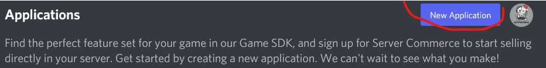
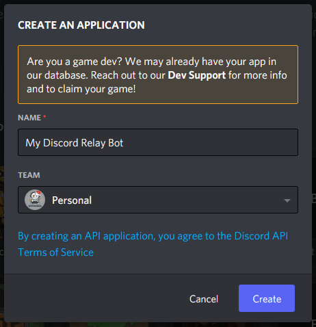
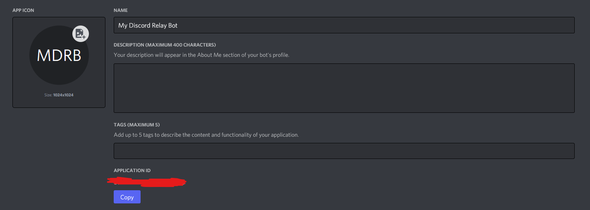
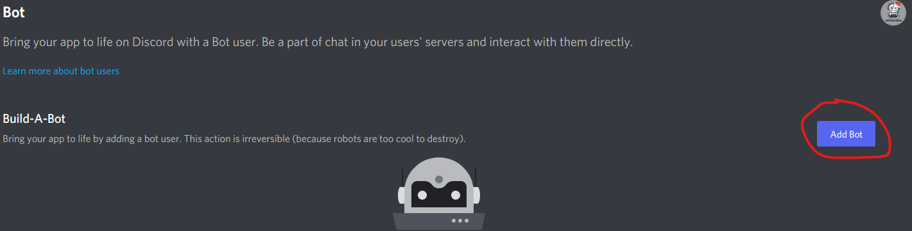
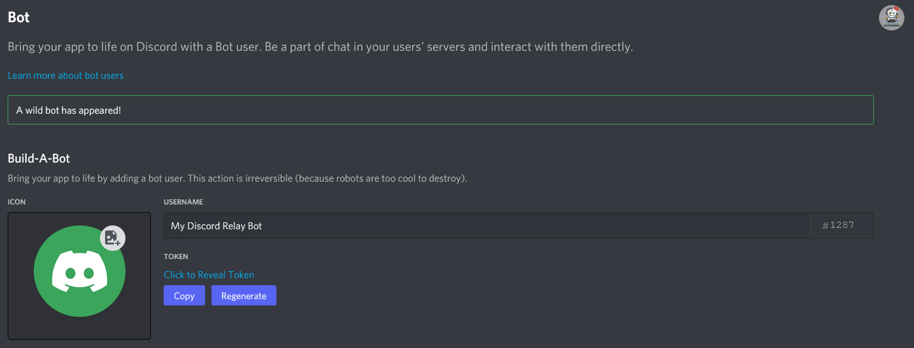
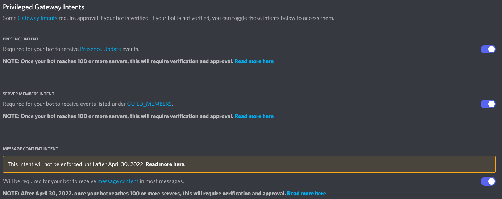
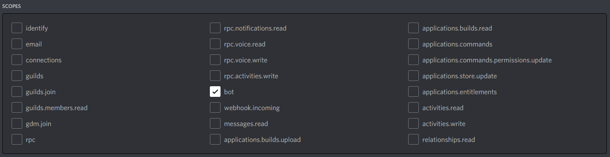
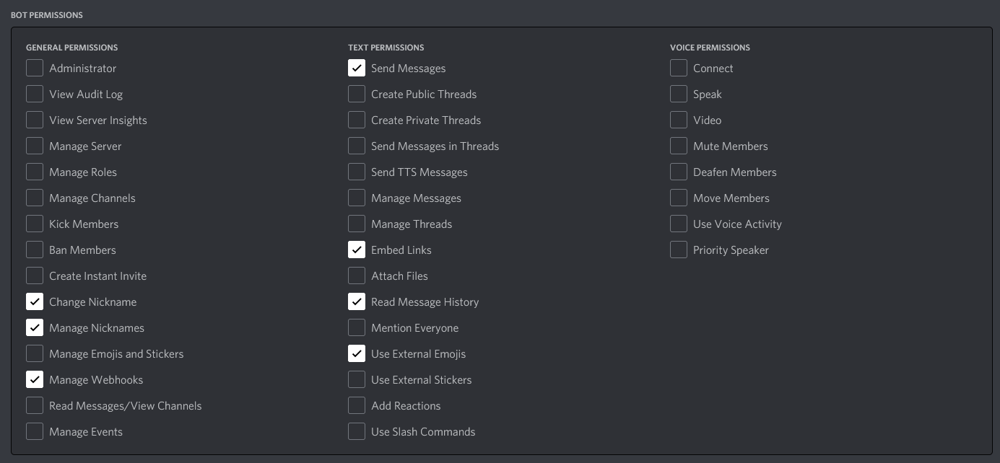
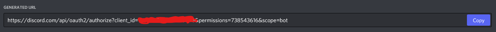

In order for this mod to work, you need to create a "Discord Bot" application. Without it, the mod will not work. If you have already used a discord chat mod in the past, you can skip this section

!!!primary By the end of this guide you should:
- Have a custom discord bot set up
- Have the bot invited to your server
  !!!
  &nbsp;

### Part 1 - Creating the Custom App
&nbsp;  
To get started, head over to [https://discord.com/developers/](https://discord.com/developers/) and sign in using your discord account. After signing in, you will be taken to the Discord Developer Dashboard. Press the "New Application" button located at the top right of the screen

&nbsp;  
You will get a popup prompting you for a name. Enter the name you'd like your bot to have and click "Create"

&nbsp;  
Once you created your app, you will be taken to a General Information Page. Here you can give your app a description, change the icon of the app and create a bot. You can skip this page and click on `Bot` on the left-hand menu

&nbsp;
&nbsp;
### Part 2 - Creating the Bot
&nbsp;  
We are now ready to create the "Bot" and get the "token" needed by the mod. On the left hand menu, click `Bot` and you will be taken to the create bot page.

To get started, click `Add Bot` and you will be prompted if you are sure you want to "Add a bot to this app". Click "Yes, Do it!" to create the bot.
&nbsp;
&nbsp;

Once you have created the bot, you can change the name if you want to and also upload a Profile Picture for the bot. Also click "Copy" underneath "Token" to copy your bot token to the clipboard, and I suggest pasting this in notepad or somewhere you can find it again later. You will need this later for the app.

!!!warning
KEEP THIS TOKEN PRIVATE AT ALL TIMES! If someone gets hold of this token, they can run another bot, acting as yours
!!!
&nbsp;

### Part 3 - Bot Permissions and Inviting the bot
&nbsp;  
On the same page where you found the Bot Token, scroll down until you see `Privileged Gateway Intents`. Enable all 3 of them

&nbsp;
Due to a recent change in the discord API for bots, you also need to enable the `GUILD_MEMBERS` and `MESSAGE_CONTENT` intents as well. Without this, the bot will not start
&nbsp;

The final step now is to invite the bot to your server. To do this, head over to the "OAuth2" -> URL Generator tab on the left-hand menu. This will allow you to generate an invite link to invite the bot to your server.

Under the "Scope" section, click "bot" and scroll down to "BOT PERMISSIONS". Under that, choose the following permissions.

After completing this step, scroll down click "Copy" next to the URL/Link shown in the text box. Now visit this link to invite the bot to your server.

!!!info
If you have invited the bot before (version 1.0), then simple visit the new url in your browser to update the bot permissions. YOU DO NOT NEED TO KICK THE BOT FOR THIS!
!!!
