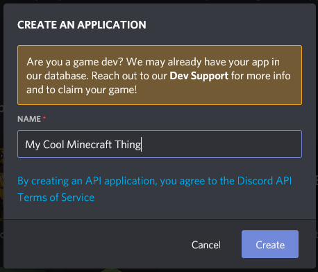
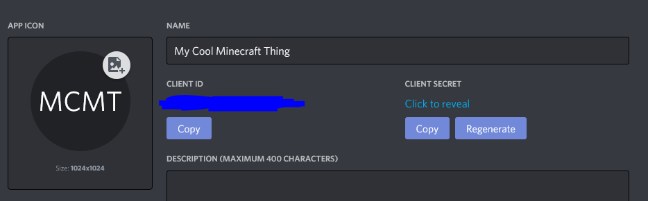
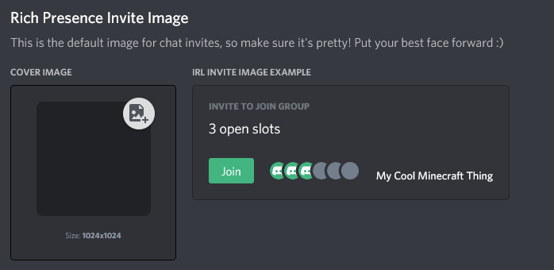
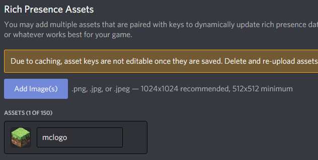

Out of the Box, Simple RPC will use "Minecraft" as the name of the game you are playing. **If this is all you want, ignore this page.**

While this is ideal for most people, you might want to display the name of your Modpack instead of "Minecraft". This guide aims to help you set this up.

!!!primary By the end of this guide you should:
- Have a custom discord app set up
- Have all your RPC images uploaded
- Have your custom app name displaying on discord
!!!
&nbsp;  

### Part 1 - Creating the Custom App
&nbsp;  
To get started, head over to [https://discord.com/developers/](https://discord.com/developers/) and sign in using your discord account. After signing in, you will be taken to the Discord Developer Dashboard. Press the "New Application" button located at the top right of the screen

&nbsp;  
You will get a popup prompting you for a name. Enter the name of your modpack or anything else you'd like and click "Create"

&nbsp;  
Once you created your app, you will be taken to a General Information Page. Here you can give your app a description, change the icon of the app and find the **Discord ID** required by the mod. Take note of this as you will need it later

!!!primary
It's recommended that you upload an icon. The minimum size of your image needs to be at least **1024x1024px**
!!!
&nbsp;
&nbsp;  
### Part 2 - Uploading the assets
&nbsp;  
Once you are done setting up the general information for your app, head over to "Rich Presence" from the left side menu. This will take you to the "Assets" page of your app. Here you can upload and manage images that get shown on your Discord Status.

!!!primary
If the "Cover Image" is empty, it's recommended that you upload an image here. As before, it needs to be a minimum size of at least **1024x1024px**
!!!
&nbsp;  
* On the bottom of the page, you can upload your icons for use by the mod

!!!primary
Your icons need to me a minimum size of **512x512px**. **1024x1024px** is recommended
!!!
!!!warning
By default the image key will be the same as the file name. Take note of them as you need them later on in the config.
!!!
!!!danger
After saving, your assets may appear empty. This is normal, but you can still use them. They will show up again on the dashboard after a couple of minutes.
!!!
&nbsp;  
&nbsp;  
There you go. You should now have your custom app setup and ready for use. Next, check out How to configure the config to make use of your app
