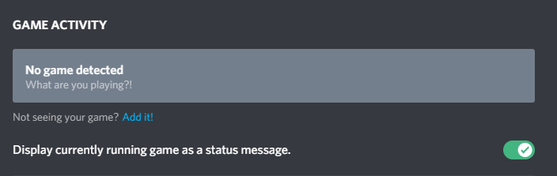

While this mod normally works perfectly the first time, there are some cases where it may not.

### My status won't display
&nbsp;  

Lets rule out the most common issues here.

* Make sure you have an active internet connection. This mod requires internet, because it needs to communicate with the Discord API.
* You might have disabled game activity on Discord. To check this, head over to `Settings -> Gaming activity`.

* If you are not using the default config file, chances are there is an error with the config file. Double check that the TOML syntax is correct by using a site like https://www.toml-lint.com/.
* **Check that the Client ID matches the one from your Discord Developer Dashboard. If you copied the ID from ANYWHERE ELSE, it's wrong, and the mod won't work**

&nbsp;  

### This mod crashes my game!

This section only applies to versions before 1.3. A crash would occur if you have an error in your config file or if something went wrong while communicating with discord.
